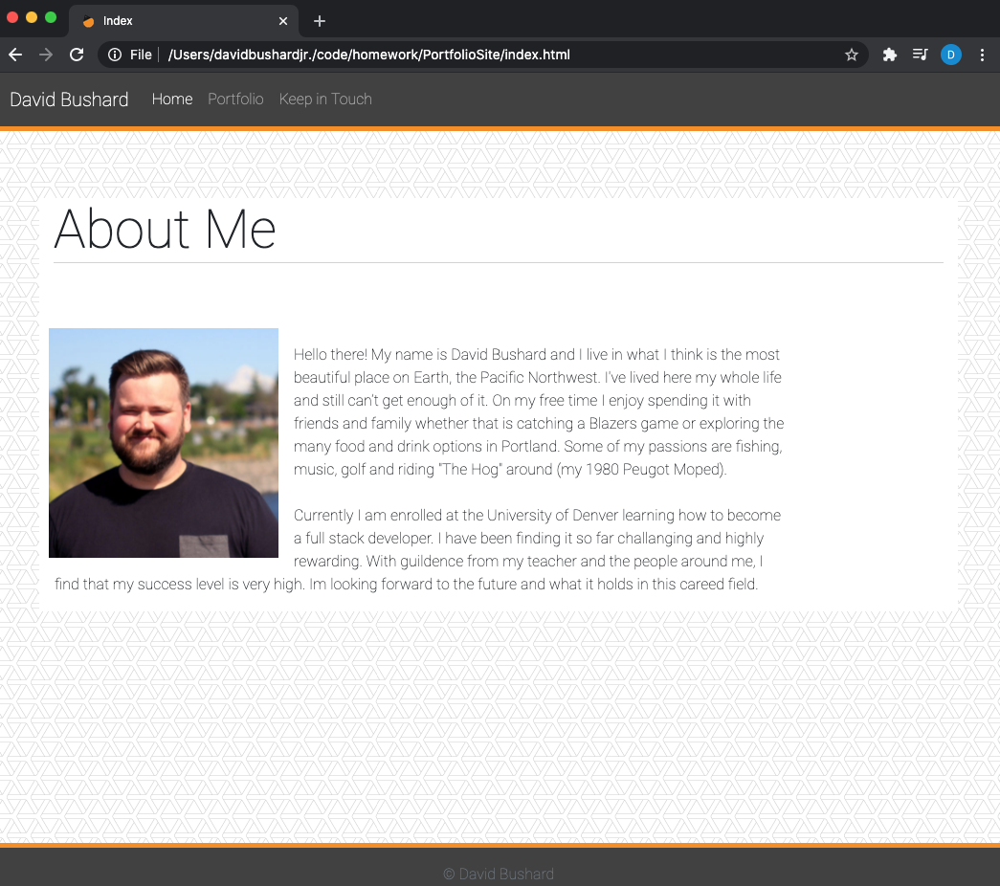
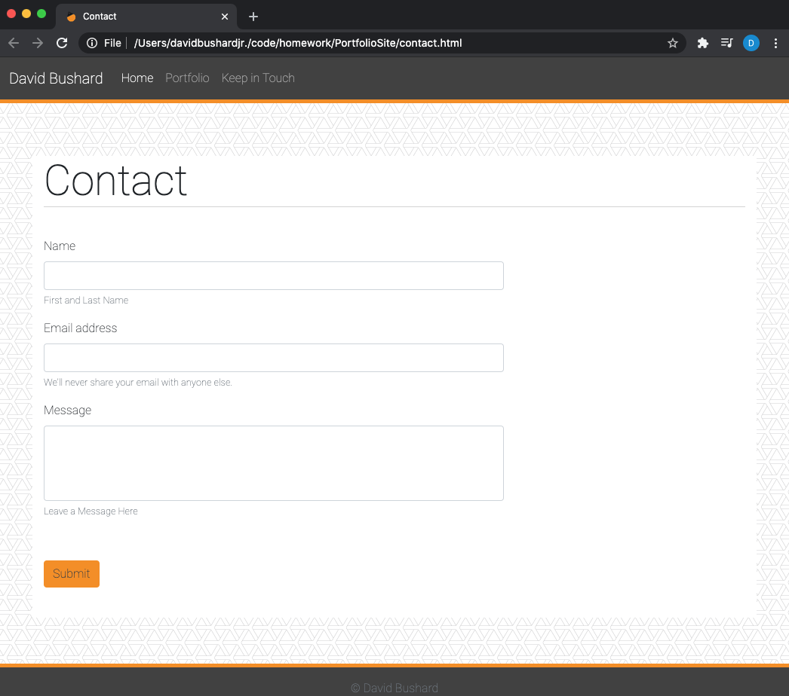

# Portfolio Site

For this assingnment I used Bootsraps and CSS to create a web page that showcases some of my understanding of using the two together to create a Portfolio Web Site.

Below are some of the criteria and requirements for the responsive site that I made. 

 

## What I did.
* I used Bootstrap CSS Framework to create a mobile responsive portfolio.

* I used following files`index.html`, `portfolio.html` and `contact.html`.

* Used Bootstrap, and developed develop the site with the following items:

   * A navbar

   * A responsive layout

   * Responsive images

* Used Bootstrap to minimize the use of media queries. I also used Bootstrap's grid system (containers, rows, and columns).

* Used an HTML validation service and did my best to ensure that each page has valid HTML.

 
 

# With this site I made sure that it is/has...

* Functional, deployed application

* A GitHub repository with README describing the project

* A Navbar must be consistent on each page.

* A Navbar on each page and links to Home/About, Contact, and Portfolio pages.

* All links work.

* Each page has valid and correct HTML. (use a validation service)

* Must contain your personalized information. (bio, name, images, links to social media, etc.)

* Must properly utilize Bootstrap components and grid system.

* Used Bootstrap to make a sticky footer 

 
 

##  https://github.com/DavidBuoy/PortfolioSite
 
 

# Screenshots
### Wide View

 
 

 
 

### Mobile

 
 

(screenshots/SS-All.png)